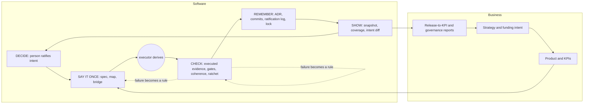

# The whole lifecycle: a proposed structure

**Status: proposal, design only.** This page arranges what the method already has, and what it lacks, along the life of a piece of software and of the business around it. It is a map for deciding what to build next, not a result. Where a cell says "design only", nothing exists beyond the sentence. The page does not extend the method's claims (see [What this does not claim](#what-this-does-not-claim)).

It exists because the method began as a way to make the Inversion (state intent, let an assistant build, verify without reading every line) workable, and the same pieces turn out to bear on later phases too: operating, repairing, moving, retiring, answering an auditor. The question is whether one small set of functions covers them without adding a new artifact for every phase.

## 1. The five functions

The mechanisms that realize each function, the gap analysis and a one-page executive table are in [the functions map](functions-map.md). Do not cite either externally until the vendor-diverse repeat is done.

Validated in a first round of blind critics (all one model family; vendor-diverse repeat owed, see [the runbook](COPILOT-CRITIC-RUNBOOK-FUNCTIONS.md)). Three independent readers of the Compendium, given no function list, each derived 11 or 12 functions; the original three (Say it once, Stop bad changes, Remember everything) covered them partly, and ratifying and reporting state were missing. The revised set is five **functions that govern the executor**, plus two **invariants**.

| Function | The job | Failure when absent |
|---|---|---|
| **SAY IT ONCE** | Intent as one written source (what, why, how, what not), findable: the spec cascade, the bridge disciplines, the map (sentinel), bounding of surface | The assistant assumes; reads too much; the same fact lives in two places |
| **CHECK** | Independent, non-model verification and blocking: executed behavior checks (phase collapse), gates, hooks, CI, coherence of spec and code, the debt ratchet | Claims of "done" with no evidence; silent regressions |
| **REMEMBER** | Decisions and changes on record: ADR/EDR, ratification log, atomic typed commits. Status and the lock are derived indexes of the record, not the record | A new session or person undoes a decision it cannot see |
| **SHOW** | State reported to people who do not read the code: rubric letters and levels, criteria coverage, snapshot, intent diff, value reports | Nobody outside can tell where the project stands |
| **DECIDE** | A person ratifies what "correct" means and what ships; the specificity dial sets how much rigor each part warrants | The executor grades its own work; rigor is all or nothing |

**Invariants (hold across functions, not functions):** (i) the executor derives artifacts from the spec; this sits between Say and Check and is not itself governed here; (ii) the ratchet: checks only tighten, and every failure becomes a permanent rule, with the triage (cases a to e) as its operator. **Rule used to tell them apart:** a function is a job whose absence leaves a distinct failure that no other function prevents; an invariant is a property that must hold in every function.

**Orthogonal axis, not a function:** the channel. The same function can hold by hand (M1), by a file the assistant reads (M2), by a tool (M3, M4), by a hook (M5), by CI (M6) or by an enforced gate with a ratchet (M7), per [the method-versus-enforcement note](#enforcement-channels). Guides are advisory; sensors are not.

**Signed ratification and agent-commit marking** (Decide, with Check at the hook and in CI): ratification can be signed with a person's SSH key and checked against a roles file, and agent-made commits are marked (`Assisted-by`, `Co-Authored-By`) and never carry an agent `Signed-off-by`. It proves custody of a key and makes skipping the step visible; it does not prove that a person decided, and an unmarked agent session is invisible. See [agent commit marking](/practice/agent-commit-marking/) (design, tools tested, not yet in a registered run).

**One-command start and scale-adaptive depth** (Say, with Check at the hook; Decide for the risky class): `gs-init` installs the substrate at L0 (sentinel and skeleton), L1 (plus gates, chained hooks, ratchet) or L2 (plus ratifications and a CI re-check) and proves its claim with `gs-check --strict` on a copy; [scale-adaptive depth](/practice/scale-adaptive-depth/) says how much of it a tiny, a normal and a risky change needs. Design, installer tested, not in a registered run; the classification of a change is a person's call except for protected paths at L2.

**Executive wording:** three verbs, "say it once, check it, remember it", and for the human side "see it, sign it" (Show, Decide). Technical documents use five.

**Mapping to the canon:** the bridge is Say; the sentinel is Say (the map half; its bounded-context role also serves Check indirectly); phase collapse is Check (executed evidence outside the model); the lock is Remember in form and Check in operation (a stale lock fails a build); ratification is Decide, its log is Remember.

## 2. The loop

Reading: a person decides the intent; the intent is written once; the executor derives; independent checks produce evidence; the record keeps the why; the state is shown; the person decides again. Failures flow back as new rules (the ratchet). The business loop wraps it: strategy sets intent, reports close the loop. The business loop is **a proposal with no tooling** (the Compendium's Part C is design only).

## 3. Phases

**Software:** idea and intent; specification; creation; extension; environments and release; operation and evolution in production; keeping the lights on; remediation; migration; disposal; post-mortem; continuous auditability; technical-debt delta. **Business:** strategy and funding intent; product and KPIs; release-to-KPI reporting; governance reporting; due diligence and M&A readiness; maturity ladder; retirement.

Continuous auditability and debt delta are not phases but properties of every change; they are rows because the questions "what changed between two dates" and "did it get worse" need an owner.

## 4. The matrix: phase by function

Only the cells that earn their place are filled; a missing cell means no artifact is needed beyond the generic ones (minimal-sufficient: every added artifact must pay for itself, and the harness itself degrades the agent when it grows). Columns: **Artifact** is the smallest thing that satisfies the cell. **Channel** is the strongest enforcement named, M1 to M7. **Formula** is a prompt in [Formulas](/formulas/) (F1 Greenfield, F2 Adopt, F3 Join, F4 Refine, F5 Change, F6 Verify, F7 Gate, F8 Lock, F9 Audit, F10 Experiment, F12 Migrate, F13 Verify-substrate); "none" is a backlog item. **Tool** is `gs-check` (checks the twelve substrate items), `gs-lock` (lock and co-change gate), `gs-review-surface` (proposed, specification only, lists what a human must still read in a diff), or none. **Human** is the point where a person decides. **Status** is one of: *design only*, *demonstrated once* (one run or crafted scenarios, no comparison), *under test* (a design is drafted in the experiment backlog), *observation* (author or cohort report).

### 4.1 Software phases

| Phase | Function | Artifact | Channel | Formula | Tool | Human | Status |
|---|---|---|---|---|---|---|---|
| Idea and intent | SAY | Intent record: the problem, a measurable outcome, what is out of scope | M1 | none | none | Person states and signs the outcome | design only (the Compendium marks the pre-spec artifact as absent) |
| | DECIDE | Go/no-go note with owner and date | M1 | none | none | Yes, whether to proceed | design only |
| Specification | SAY | Spec with requirement ids; acceptance criteria with ids and how each is verified; open-questions list | M5 (open-questions gate) | F1, F2, F4 | `gs-check` | Ratifies criteria; the executor has no write access to them | demonstrated once (course lab, sample project) |
| | CHECK | Criterion without a verification method counts as uncovered | M5 | F4, F13 | `gs-check` | None | design only |
| | REMEMBER | Decision records for choices made while specifying | M2 | F1 | none | Ratifies | observation (author's projects) |
| Creation | SAY | Sentinel/map, derived cascade, conventions | M2 | F1 (greenfield), F2 (after an MVP) | `gs-check` | Ratifies the cascade | demonstrated once; field cases self-reported |
| | CHECK | Tests plus one blocking gate proven red once and green in a clean clone; executed behavior check | M5 to M6 | F6, F7 | `gs-check` | None | demonstrated once (EX, builder-counted) |
| | REMEMBER | Atomic typed commits citing criterion ids | M5 | F1, F5 | none | None | design only |
| Extension | SAY | Spec delta first, then code | M5 (commit hook) | F5 | `gs-lock` | Ratifies the delta | demonstrated once (crafted scenarios) |
| | CHECK | Co-change gate: behavior change cites or stages a spec change; debt ratchet | M5 to M7 | F5, F7, F8 | `gs-lock` | None | demonstrated once (35 crafted scenarios, one sample project) |
| | DECIDE | Review of what no tool judges | M1 | F5 | `gs-review-surface` (proposed) | Reads the listed places | design only (tool is specification only) |
| Environments and release | CHECK | Release gate on shared branch; staging probes against criteria | M6 | F6 | none for probes | Approves release | observation (one project); no controlled study |
| | REMEMBER | Release note linking criteria to build id | M2 | none | none | None | design only |
| | SHOW | Criteria coverage for this build and environment | M3 | none | none | Business role ratifies the criteria set | design only |
| Operation and evolution in production | CHECK | Drift and health probes tied to criteria | M6 | none | none | Decides on a rollback | observation (production use self-reported) |
| | SAY | External triggers (incident, user report) written as spec deltas | M1 | F5 (triage) | none | Ratifies the delta | observation |
| Keeping the lights on | CHECK | Dependency and vulnerability delta per change | M6 | none | none | Accepts or defers an update | design only (the canon marks this phase not covered) |
| | REMEMBER | Record of accepted risks, with expiry date | M2 | none | none | Owner signs | design only |
| Remediation | SAY | Recovered spec of what exists | M1 | F3, F2 | `gs-check` | Ratifies | observation (takeover cases, one engineer each) |
| | CHECK | Characterization tests; ratchet from the first day | M5 to M7 | F6, F7 | `gs-lock` | None | under test for the cost mechanism (duplication, n=2) |
| Migration | SAY | Recovered spec and a characterization suite | M1 | F12 (case A) | `gs-check` | Ratifies equivalence criteria | demonstrated once (one case, no comparison arm) |
| | CHECK | Equivalence checked by a program | M5 | F12 | none | None | demonstrated once |
| Disposal | SAY | Retirement criteria and data-retention rules, written | M1 | none | none | Owner signs | design only (canon marks it not covered) |
| | CHECK | Checklist: dependents, data export, credentials revoked | M1 | none | none | Yes | design only |
| | REMEMBER | Retirement record kept after the code is gone | M2 | none | none | None | design only |
| Post-mortem | REMEMBER | Incident record: what happened, case a to e, the rule that now prevents it | M2 | F5 (triage only) | none | Ratifies b, c and d | design only (canon: no incident template) |
| | CHECK | The new rule or test exists and fails against the old code | M5 | F5, F7 | `gs-check` | None | demonstrated once (rule checked on one sample) |
| Continuous auditability (every change) | REMEMBER | Chain per change: criterion, decision, commit, check result | M5 | F5 | `gs-lock` | None | design only (a single "chain for change X" query is not verified) |
| | SHOW | Intent diff for the signer | M3 | none | `gs-review-surface` (proposed) | Signer reads it | design only |
| Technical-debt delta (every change) | CHECK | Stored baseline the executor cannot edit; delta per measure must be at or below zero | M7 | F7 | none | Raises the floor knowingly | design only for the combined gate; cost of duplication under test (SX, n=2) |

### 4.2 Business phases

| Phase | Function | Artifact | Channel | Formula | Tool | Human | Status |
|---|---|---|---|---|---|---|---|
| Strategy and funding intent | DECIDE | Funding intent: what the money is for and the outcome that would justify more | M1 | none | none | Executive owner | design only |
| | SAY | Link from each product intent to the funding intent | M1 | none | none | Owner | design only |
| Product and KPIs | SAY | KPIs per feature, how each is measured, the baseline | M1 | none | none | Product owner | design only (Part C4, proposed, nothing built) |
| | CHECK | A KPI with no measurement method is reported as unmeasured | M3 | none | none | None | design only |
| Release-to-KPI reporting | SHOW | Feature, cost, KPI movement per release, each stating how it was measured | M3 | none | none | Owner reads; no ROI claimed | design only |
| Governance reporting | SHOW | Snapshot line: level, grade per property, score and confidence, rubric version, commit, spec version, date | M3 | F9 (free scorecard) | `gs-check` (partial) | Names the accountable role | design only for the exact line; the scorecard is coarse and read by a model |
| | REMEMBER | Archive of snapshots, compared at the same spec version | M2 | none | none | None | design only |
| Due diligence and M&A readiness | SHOW | Evidence bundle from existing files: provenance of AI output, review trail, decisions, security posture, snapshot | M3 | none | none | Seller and buyer's reviewers decide | design only; practitioner sources only, no framework covers it |
| Maturity ladder | SHOW | Portfolio table of snapshots, commits since each | M3 | F9, F13 | `gs-check` | Sets the target level per project | design only (Part C1) |
| | DECIDE | Target level per project from consequence class | M1 | none | none | Yes | design only |
| Retirement of the product or business line | DECIDE | Sunset decision with owner and trigger | M1 | none | none | Executive | design only |
| | REMEMBER | Record of why, what was kept, what was destroyed | M2 | none | none | None | design only |

## 5. Backlog: cells with no formula yet

Intent record and go/no-go (idea); release note with criteria; production probes; dependency and vulnerability delta; accepted-risk record; disposal checklist and retirement record; incident record; chain-for-change query; release-to-KPI report; KPI definition; snapshot generator; snapshot archive; due-diligence bundle; sunset decision. About fifteen items; the rest of the matrix has a formula or a tool, at most of the "written to the canon, not yet tested in a registered run" kind.

## 6. First three cells to build

Chosen for leverage and cost, not for importance:

1. **SAY at idea and intent: the intent record and its formula.** The loop starts here and nothing exists. A page of fields (problem, measurable outcome, out of scope, owner) plus a prompt; checkable by `gs-check` as a present, signed file. Low cost, and it is the missing upstream half of the criteria-coverage definition.
2. **CHECK/DECIDE at extension: `gs-review-surface`.** Its specification already exists (revision 2, after a fresh-critic round). It is the one tool that narrows what a human must read, which is where the method says judgment is irreducible.
3. **REMEMBER at post-mortem: an incident record plus formula.** It closes the ratchet: every defect leaves a record, a case (a to e) and a rule. It fills the one named gap that a one-page template can close.

The [functions map](functions-map.md) ranks gaps by how thin each function is and adds two candidates, a ratification record with a required-marker hook (DECIDE) and the snapshot generator (SHOW); the three above were chosen by phase leverage, the map's five by function weakness, and JC chooses the order. Next after these: the snapshot generator (SHOW at governance reporting), because the governance claim ("governed as of") has no tool producing its exact line.

## 7. Enforcement channels

Each cell's check should name how it holds. Summary of the ladder (from the method-versus-enforcement note, private proposal): M1 per prompt by hand; M2 a root file the assistant reads (advisory); M3 retrieval or MCP tool; M4 an instruction to run something (self-reported); M5 a hook; M6 a CI gate; M7 an enforced gate with a ratchet the executor cannot edit. The prediction that the channel decides whether a function holds over time and across people is **untested**; at one increment and one expert the arms tie.

## 8. Proposals (nothing applied)

**Site navigation.** Under **The Method**, add a child page after "Lifecycle and debt" (nav order 8): "The whole lifecycle" at `/method/lifecycle-whole/`, with the FAQ as its sub-page. The page ships with `nav_exclude: true` so it is not in the menu until JC decides. "Lifecycle and debt" keeps the six definitions; this page is the map over them.

**White paper 5.0.** Do not edit now. Proposed placements: a pointer box at the end of 3.6 "The cycle" naming the five functions as the structure of the cycle, labeled proposal; one sentence in 4.3 (Part C) that the organization layer is the SHOW and DECIDE functions applied across projects; in section 6 ("What this paper does not claim") the four statements below. Compendium 8.19 (lifecycle table) could cite this page for the backlog. The Compendium's 10.1 reference to a "14-point rubric" should be checked against the seven-property text before any of this is cited.

## What this does NOT claim

- That the five functions are proven complete. One round of same-vendor blind critics, 56% of 84 mechanisms mapped cleanly to one function and about 83% mapped without a forced fit; vendor-diverse repeat is owed.
- That the method covers the whole lifecycle. It does not: disposal and keeping the lights on are uncovered in the canon, and most business-side cells are design only.
- That the structure improves outcomes, cuts cost or yields a return. No experiment tests it. The measured results behind parts of it are small (n=2 to n=5), one author, mostly one model family.
- That the business loop works or that an auditor, buyer or regime accepts the artifacts. Untested.
- That this is novel at function level. Spec-first, gates and an audit trail are old; what is distinct lives in the mechanisms (an independent non-model checker the executor cannot edit, the lock, ratification as the terminus, the dial), not in the five names.
- That the method pays at small scale or short horizon. The author's expectation is that it pays for long-lived, multi-contributor or audit-sensitive work, and not for spikes and prototypes.

## Falsification (what would show the structure wrong)

A sixth function would be needed if a critic, vendor-diverse or not, finds a Compendium mechanism that fits none of the five, or an invariant, with a distinct failure mode no function prevents. The structure is redundant if removing one function (for example SHOW, merged into REMEMBER) leaves every failure in the table above still prevented. Both are testable by the roles in the runbook.
