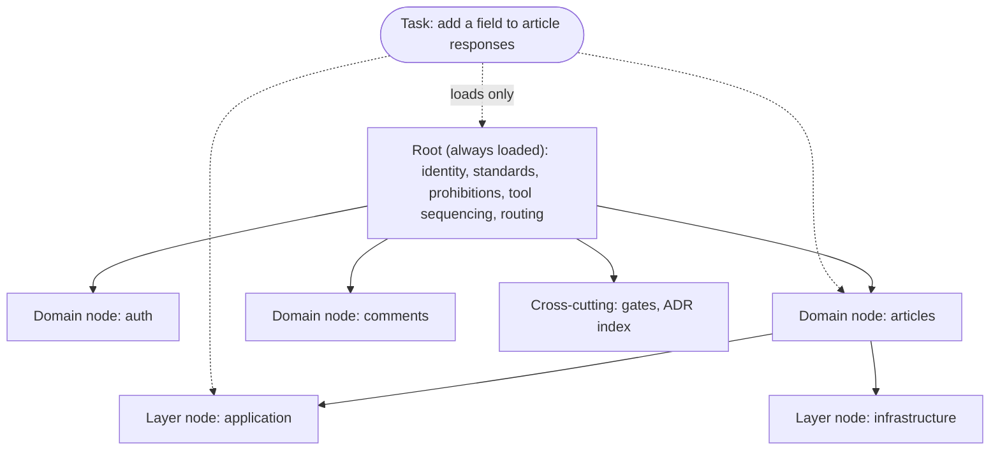
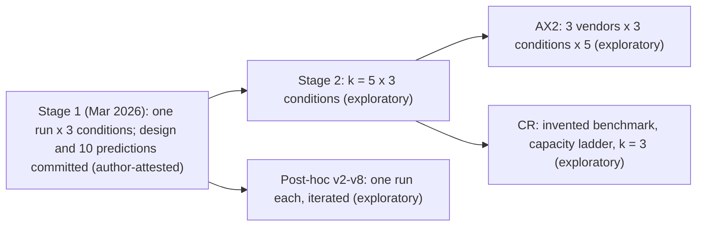

# Figures for the IEEE Access draft

| Fig. | Content | Status |
|---|---|---|
| 1 | Sentinel navigational tree: a root instruction file with scoped child nodes and the five categories, showing what a session loads for one task | Rendered: `fig1-sentinel-tree.svg` (from the Mermaid source below; draft layout, check legibility at column width) |
| 2 | Study design: three conditions (naive, expert prompt, GS) by two stages (original single run; k = 5 replication) plus the post-hoc series, the cross-vendor study and the capacity ladder, each labelled with its design and registration status | Rendered: `fig2-study-design.svg` (from the Mermaid source below; draft layout) |
| 3 | Individual runs per condition for four metrics (k = 5) | Generated: `fig3-strip-plot.svg`, from `experiments/ax/runner/results.csv` |

## Fig. 1 source

## Fig. 2 source

## How Figs. 1 and 2 were rendered

Mermaid 10.9.1 loaded from cdn.jsdelivr.net in headless Chromium driven by playwright-core (no global install, no mermaid-cli), theme neutral, `htmlLabels: false` so the SVG has plain text and no foreignObject. The Mermaid layout is automatic: Fig. 1 places the task node above the root; reorder in the source if the template layout needs it. Grayscale, so it survives IEEE print.
