# The GS paper tree: root, trunks, leaves (2026-10-03)

Status: PROPOSAL for JC to accept, alter or reject. Nothing here is registered, run or submitted. Written 2026-10-03 on branch `paper-tree-2026-10-03`.

This file replaces the role of `C:\workspace\PragmaWorks\gs\gs-paper-tree\docs\white-paper\THREE-PAPER-ROADMAP.md` and `C:\workspace\PragmaWorks\gs\gs-paper-tree\docs\white-paper\PAPER-TREE.md` (both split by theme; this one splits by orthogonal contribution and by evidence). Nothing in those files is deleted; section 9 says where each old node went. Companion files in this folder: `BRANCHES.md` (the separable LOOM, BIOISO and CHRONICLE branches and the tool/artifact leaves, which are part of this tree), `MIGRATION-MAP.md`, `ROOT-skeleton.md`, `M-skeleton.md`, `P4-skeleton.md`, `P6-skeleton.md` (trunk P6, added 2026-10-03), `TESTING-WITHOUT-DECEPTION.md`, `FIELD-STUDY-TEAMS.md` (proposal for a prospective field study with real teams).

JC's decisions of 2026-10-03: the ROOT and the orthogonal set are ACCEPTED "with these extras" (trunk P6 below; the Decisions section 11 below; the field-study note). Everything else in this file is still a proposal.

Inputs read (all absolute): `C:\workspace\PragmaWorks\soma\docs\gs-contributions-literature-map-2026-10-02.md`, `C:\workspace\PragmaWorks\soma\docs\productivity-studies-dissection-2026-10-03.md`, `C:\workspace\PragmaWorks\soma\docs\personal-repos-productivity-analysis-2026-10-03.md`, `C:\workspace\PragmaWorks\soma\docs\strategy-3yr.md`, `C:\workspace\PragmaWorks\soma\docs\PAPER-TREE.md`, and under `C:\workspace\PragmaWorks\gs\gs-experiment-protocol\docs\experiments\`: `EXPERIMENT-PROTOCOL.md`, `HYPOTHESES-2026-10-02.md`, `BACKLOG.md`, `LOGBOOK\README.md`, `prereg\SDX-1.md`, `prereg\SDX-1-ARMS.md`, `REPLICATOR-BRIEF.md`.

Important state fact: the protocol, the logbook, the preregistration drafts and the hypotheses file live on branch `experiment-protocol-2026-10-02` and are NOT on `origin/main`. Every paper in this tree cites logbook entries, so the logbook must be merged and archived (Zenodo) before any node is submitted. Canonical post-merge path: `C:\workspace\PragmaWorks\gs\generative-specification\docs\experiments\`.

---

## 1. Principles

1. **One construct, one manipulation, one untargeted primary outcome per trunk.** Trunks are orthogonal when removing one component of the substrate moves one outcome and not the others (the prediction matrix of the literature map, section 4.3; repeated in section 5 below). Where two trunks must share data (chains, fixture), the overlap is declared and counted once (`HYPOTHESES-2026-10-02.md` section 8).
2. **Split by evidence, not by theme.** The root is defensible with today's evidence (all tier C/D). Each trunk is publishable only after its own experiments report. Nothing is claimed ahead of its tier.
3. **The root is a ledger and an agenda, not a result paper.** It states what is and is not known, with the logbook tier of every claim, and the preregistered programme that will move each claim. It is updated as leaves report.
4. **Negative and null results are first-class content.** The logbook already holds nine closed rows with an INVALID-DESIGN label and no REFUTED row (`LOGBOOK\README.md`, index of 2026-10-02). That record is the asset of trunk M, not a thing to hide.
5. **Certainty is a prior, not evidence.** JC's field experience motivates the programme and is written down in falsifiable form (guard f of the protocol). The tree is built so that "works for JC" and "works" are separable (`TESTING-WITHOUT-DECEPTION.md`).
6. **Speed is not a head-start claim.** The baseline literature on AI speed is contested (literature map 1.1). The flagship is durability (P4), with net throughput over a growing repository as a registered crossover (SDX-8), and P6 asks a different, narrower question: given a fixed reviewed spec, how fast and at what cost does an assistant reach a verified COMPLETE implementation, stage by stage, with the substrate's overhead counted and a registered crossover stage. Neither promises initial speed; the honest prior is that the substrate is slower or equal early.

## 2. The tree (diagram)

```mermaid
flowchart TD
  COMP["COMPENDIUM v5.0 (canonical master, not submitted; DOI snapshot)"]
  LOG["LOGBOOK + protocol + prereg archive (Zenodo/OSF); the only source of results"]
  ROOT["ROOT R0: GS framework, evidence ledger and preregistered programme"]

  COMP --> ROOT
  LOG --> ROOT

  ROOT --> P4["P4 FLAGSHIP: durability under iteration (+ net-throughput crossover)"]
  ROOT --> P1["P1 navigation economy"]
  ROOT --> P2["P2 executed-verification yield"]
  ROOT --> P3["P3 coherence and reconstructability"]
  ROOT --> P5["P5 practitioner variance and learning"]
  ROOT --> P6["P6 spec-to-implementation throughput (stages S0-S4, verified COMPLETE)"]
  ROOT --> M["M evaluation methods and negative results"]
  ROOT --> I1["I-1 rubric validity (instrument leaf)"]

  M -. "methods rules used by all" .-> P1
  M -.-> P2
  M -.-> P3
  M -.-> P4
  M -.-> P5
  M -.-> P6

  subgraph LEAVES_P4 [P4 leaves]
    S0["SDX-0 harness validity report"]
    S1["SDX-1 expert prompt vs substrate, 10 changes"]
    S2["SDX-2 ablation, frontier cell, enforcement-only arm"]
    S8["SDX-8 (proposed) long chain, growth, crossover"]
    TRF["TRF-1 (proposed) prospective adoption by other developers; field-study design in FIELD-STUDY-TEAMS.md"]
  end
  P4 --> S1
  P4 --> S2
  P4 --> S8
  P4 --> TRF
  S0 --> S1

  P6 --> S9["SDX-9 (proposed) spec to COMPLETE in stages"]
  S0 --> S9
  P1 --> S4["SDX-4 map at scale"]
  P2 --> S5["SDX-5 layers A, B, C"]
  P3 --> S3["SDX-3 audit and reconstruction"]
  P5 --> S6["SDX-6 prompt-author study"]
  P5 --> S7["SDX-7 live human study"]
  P5 --> TRF
  M --> B11["B11 judge validity"]
  M --> S0

  subgraph FIELD [Field, case and exploratory leaves]
    CEN["CEN-0 personal-repos census (tier D, private)"]
    WS["WS-1 workshop field evidence (tier D, private source)"]
  end
  CEN -. "hypothesis-generating" .-> TRF
  WS -. "hypothesis-generating" .-> P5

  subgraph REPL [Independent replications]
    R1["SDX-1-R1 ... SDX-n-Rk (own entries, own tier)"]
  end
  S1 --> R1
  S5 --> R1

  subgraph ART [Tool and artifact leaves]
    A1["A-1 Pastura benchmark + harness + oracle"]
    A2["A-2 Chronos / CodeSeeker-type tool papers (JC decision)"]
  end
  S0 --> A1
  ROOT --> A2

  subgraph NONPAPER [Practitioner products, not papers]
    FG["Field Guide, Practitioner Protocol, Rubric ScoringGuide, course"]
  end
  COMP --> FG

  MOD["C6 capacity moderator: a registered factor inside P1-P4; leaf CR2 (B5) only"]
  MOD -.-> P1
  MOD -.-> P4
  MOD -.-> P6

  subgraph BRANCHES [Separable PhD-compendium branches, see BRANCHES.md; independent claims]
    LOOM["LOOM L0: first-class semantic constructs, multi-target language"]
    LM1["LM-1 language and checkers"]
    LM2["LM-2 ALX self-applicability"]
    LM3["LM-3 LX-4 stateless derivability"]
    LM4["LM-4 LX-1 semantic density (reported FAIL)"]
    LM5["LM-5 claim coverage and verification"]
    BIO["BIOISO B0: ceiling hierarchy T1-T5 and T5 meiosis"]
    BI1["BI-1 ceiling hierarchy + operational model"]
    BI2["BI-2 formal autopoietic isomorphism (needs co-author)"]
    BI3["BI-3 living applications"]
    BI4["BI-4 domain validation series"]
    CHR["CHRONICLE: persistent tiered memory server"]
    ESS["Onward essay LM-6 / BI-5"]
    LOOM --> LM1
    LOOM --> LM2
    LOOM --> LM3
    LOOM --> LM4
    LOOM --> LM5
    BIO --> BI1
    BIO --> BI2
    BIO --> BI3
    BIO --> BI4
    LOOM -.-> ESS
    BIO -.-> ESS
  end
  COMP --> LOOM
  COMP --> BIO
  COMP --> CHR
  LM2 -. "tier D demonstration row only" .-> ROOT
  LOOM -. "motivation, one-way, no dependency" .-> ROOT
```

Separable branches (detailed in `BRANCHES.md`): LOOM, BIOISO and CHRONICLE are the other compendium artifacts of the PhD (`strategy-3yr.md` section 2). They have their own claims, evidence and venues, connect to ROOT one way only (ROOT may cite a branch result as a labelled tier row; no claim in either direction is conditional on the other) and are not diluted to fit GS review. Also outside the evidence tree and unchanged: the Onward! essay, the Golden Century essay, and the cheap-rigor / revival-model line (`C:\workspace\PragmaWorks\gs\gs-paper-tree\docs\discipline-revival-model.md`, BACKLOG B7). They cite ROOT and the Compendium; ROOT does not depend on them.

## 3. The tree (table)

| Node | Type | Parent | Thesis, one sentence | Logbook entries (status 2026-10-02) | Owed (BACKLOG ids) | Prereg status |
|---|---|---|---|---|---|---|
| R0 ROOT | Framework + ledger + agenda | Compendium, logbook | Specification-driven agent development can be stated as a falsifiable programme: a derivability criterion, a seven-property instrument, a five-component substrate, and six orthogonal hypotheses, with every existing claim at its honest tier. | All 18 entries as ledger rows (AX..RND-1 closed, tier C/D; SDX-0, SDX-1 designs) | none for the claim; assembly and relabelling | n/a (it reports registrations) |
| P1 | Trunk | R0 | A routed, authored map lowers tokens per accepted change as a repository outgrows a session; structure that merely bounds reading is a separate lever. | KX, TX, SX (tier C) | B0, B1 (SDX-0), B14 (SDX-4), frontier cell of B8 | none; draft hypothesis only |
| P2 | Trunk | R0 | For defects that appear only in the real runtime, executing the artifact in the open catches a share that unit, static, test-environment and effort-matched review layers miss. | EX, RX (tier D); RND-1 part (C/D) | B1, B11, B13 (SDX-5 A, B, C) | none; draft |
| P3 | Trunk | R0 | With bidirectional ids, a derivation lock and a co-change gate, memoryless auditors detect injected spec/code divergence and reconstruct history better than a decision log plus git history. | none clean (BX inconclusive; EX/RX demonstrations) | B1, B11, B10 (SDX-3), archived SDX-1 chains | none; draft |
| **P4 FLAGSHIP** | Trunk | R0 | Enforced gates (a ratchet) halt erosion over a long chain of changes where advisory guidance only shifts the starting point, and a registered crossover shows when the substrate's upkeep is repaid. | AX, AX2 (single-shot, tier C), EX (D), RND-1 (C/D), SDX-0, SDX-1 (designs) | B1, B4 (SDX-1), B8 (SDX-2), SDX-8 (new, proposed), B9 | SDX-0, SDX-1 drafts, not frozen; SDX-8 not yet drafted |
| P5 | Trunk | R0 | Holding the AI constant, the substrate narrows between-practitioner spread; whether it replaces training is a separate preregistered claim. | none | B15 (SDX-6), B16 (SDX-7), TRF-1 | none; gated on SDX-1/SDX-3/SDX-5 |
| **P6** | Trunk (proposed 2026-10-03) | R0 | Given a fixed, reviewed spec with acceptance criteria, an assistant under the GS substrate with enforced gates reaches each stage's machine-checked completeness criteria, up to a verified COMPLETE implementation, with escapes inside a pre-declared band, at a cost that crosses below the expert-prompt and generic-harness arms at a registered stage, setup and upkeep included; the claim is verified completeness, not a head start. | none clean (EX is a tier D chain without baseline) | SDX-0 (criteria-tagged oracle), B11 (audit of escapes), SDX-9 (new, proposed) | none; skeleton in `P6-skeleton.md` |
| M | Trunk (methods) | R0 | Evaluating externalized-specification methods needs untargeted metrics, non-circular keys, cross-vendor judges, headroom checks and first-class INVALID-DESIGN and null reports; one research programme's own record shows why. | the whole logbook as a case series; SDX-0 | B11, SDX-0 outcome, independent audit of the case-series classification | protocol v1.0 is the artifact; no study prereg needed except B11 |
| I-1 | Leaf (instrument) | R0 | Each of the seven properties predicts its own outcome and not the others (discriminant validity), on projects not guided by GS. | BX (INCONCLUSIVE, tier C) | rubric-vs-hidden-outcome study (BACKLOG table "Hypotheses that may be better replaced"), after B11 and trunk data | none |
| CR2 | Leaf (moderator) | P1, P4 | Value of the substrate depends on model capacity; the registered factor is model tier crossed with arm. | CR (INCONCLUSIVE, direction as predicted; tier C), AX2, MX | B5, frontier cells of B8 | none |
| CEN-0 | Field, exploratory | TRF-1 | Hypothesis generation only: in one developer's repositories, test lines per production line and test-touching commits rose and 30-day churn fell after early 2026. | not yet a logbook entry; open one at tier D before any citation | resolve employer-identity commits; add coverage and mutation measures | none, by design |
| TRF-1 | Field, prospective (proposed id) | P4, P5 | If the method works and JC is not an exceptional operator, other developers adopting it prospectively show the registered change in untargeted metrics. | none | design, recruitment, registration before adoption | none |
| WS-1 | Field, observational | P5 | Hypothesis generation only: a workshop cohort applied the discipline to its own code and the token objection followed a recurring arc. | none (white paper 5.3 reports it; private source material) | permission and anonymization review | none |
| A-1 | Artifact | SDX-0 | The Pastura fixture, locked scaffold, sealed oracle and harness are a reusable benchmark artifact. | SDX-0 | harness works; licence; DOI | n/a |
| A-2 | Tool papers | R0 | See section 7: depends on JC's current decisions. | none | JC decision | n/a |
| R-n | Replications | the replicated leaf | Independent reruns, each its own entry `<id>-R<n>`. | none | recruitment from freeze | each its own |
| LOOM (L0, LM-1..LM-6) | Branch | Compendium | Loom makes five known semantic disciplines first-class in one multi-target language designed for a reader with no memory (a language-design claim, not an AI-effect claim). | ALX (DEMONSTRATION, tier D, primary record unchecked); LX-1 reported FAIL against its own threshold; LX-4 pending | soundness and evaluation work; protocol-compliant ALX redo; run LX-4 | none; see `BRANCHES.md` |
| BIOISO (B0, BI-1..BI-5) | Branch | Compendium | A T1 to T5 ceiling hierarchy for adaptive optimizers whose top tier rewrites the algorithm across generations through a gated meiosis; formal autopoietic isomorphism is a separate, unwritten claim. | none in the GS logbook; BBOB and AEGIS runs in the Loom repository (mixed, simulated) | log entries; strong baseline; fix AEGIS wording; co-author for BI-2 | none |
| CHRONICLE | Branch | Compendium | A tiered, decaying, trigger-firing memory server gives stateless assistants continuity (to be confirmed by JC). | execution records only (tier D) | a controlled continuity evaluation | none |
| FG | Practitioner products | Compendium | Field Guide, Practitioner Protocol, ScoringGuide, course: not papers. | n/a | n/a | n/a |

## 4. Trunk cards

Venue facts used below are verified in section 6; anything not there is marked unverified. No claim about acceptance is made anywhere in this file.

### R0 ROOT (decision: a short, honest framework + evidence ledger + preregistered agenda)

- **What it is:** the single document every other node cites. Contents: the derivability premise; the seven-property instrument declared unvalidated; the substrate components L1 to L5 with operational definitions (`prereg\SDX-1-ARMS.md` section 1); the evidence ledger of every logbook entry with its tier and outcome label verbatim; the six orthogonal hypotheses (P1 to P6) plus M, the moderator and the instrument, with their dissociation predictions and refutation criteria; the preregistered programme (protocol, roles, replicators, the tree); non-claims.
- **Why this and not a result paper:** today's evidence is tier C/D throughout; no entry is tier A or B (`LOGBOOK\README.md`), so a paper that leads with results cannot be defended. A framework and agenda is defensible now, is a stable citation target, and its ledger is updated as leaves report.
- **Closest prior work:** Parnas and Clements 1986 (derivation as documentation), Meyer 1992, Lahiri 2026 (arXiv:2603.17150, intent formalization), Denisov-Blanch et al. 2026 (arXiv:2608.25241, RAMP) and Bousetouane 2026 (arXiv:2607.14275) as published "score a repository's AI-readiness" instruments, Farrag 2026 (arXiv:2605.01160) as an overlapping position paper. Novelty risk of the criterion itself: HIGH (literature map C1). So the contribution is stated as naming, decomposition into falsifiable constructs, and the honest ledger, not as a new correctness criterion.
- **Evidenced today:** the ledger itself (all rows tier C/D), the literature map, the protocol.
- **Owed:** relabelling to logbook tiers (section 8 of `MIGRATION-MAP.md`), logbook merged and archived, copy-edit, template. No new experiment is required for the root's claim.
- **Venue options:** IEEE Access (continuous submission; its guidelines describe gating on soundness; the existing draft's own note says binary decision in about 4 to 6 weeks and an APC of about $2,160, not re-verified today); an Empirical Software Engineering (EMSE) or IEEE Software route is possible later for a condensed version (IEEE Software limit: 4,200 words and 15 references, verified); a 4-page agenda version could go to ICSE 2027 NIER (verified deadline 2026-10-23).
- **Earliest realistic submission:** early to mid November 2026. Gates: JC decisions D1 to D3 (section 10), logbook merge, tier relabelling, human copy-edit, CrossCheck against the Zenodo v4.0 preprint (DOI 10.5281/zenodo.21726017).

### P4 FLAGSHIP: durability under iteration, with the net-throughput crossover

- **Thesis:** enforced gates halt erosion over a long chain where advisory guidance shifts only the intercept; a registered crossover index says when setup and upkeep are repaid.
- **Single contribution:** the channel-versus-content test: same obligations delivered as advice (prompt), as persisted text (flat file) and as enforcement (gates with ratchet), measured as slopes over checkpoints, not as a single-shot score.
- **Closest prior work:** SlopCodeBench (arXiv:2603.24755, advisory guidance lowers the starting point but not the degradation rate; verified abstract); He et al. MSR 2026 (arXiv:2511.04427, debt-to-velocity feedback loop, and it prescribes metric-triggered refactoring and self-throttling, i.e. a ratchet); Agarwal et al. (arXiv:2601.13597); RAMP (arXiv:2608.25241); SWE-Milestone and SWE-CI as instruments; DORA 2024/2025 on batch size and stability. Novelty risk: concept MEDIUM, and the test (enforced versus advisory with identical content, over a growing chain) is what no found study does.
- **Evidenced today (logbook):** nothing that tests it. AX tie and AX2 are single-shot (GS vs expert INVALID-DESIGN, ceiling; naive vs disciplined SUPPORTED as mechanism on a targeted metric, tier C); AX2's GS arm delivered the cascade as prompting, not an enforced loop; EX is a tier D demonstration (gate caught 15 builder-counted defects, no baseline); RND-1 independent verification NULL by floor (n=2). SDX-0 and SDX-1 are designed and reviewed by Claude critics only, not frozen.
- **Owed:** SDX-0 closed; SDX-1 frozen and run (H3 needs Full scope); SDX-2 with the enforcement-only arm (expert prompt plus a generic must-pass hook) and the frontier cell; SDX-8 (proposed in the dissection note as H-NET: K=30 changes, growth from about 3 to 15 kLOC, cost per durably accepted change, crossover index; not yet drafted or registered); an independent rerun (B9).
- **Orthogonality note:** SDX-8's cost metric overlaps P1's. P6 (fixed spec built in stages, SDX-9) shares the fixture but not chains and has a different estimand; see `P6-skeleton.md` section 8. Rule: P4's primary is the slope of regression flips on sealed carried probes and an untargeted erosion metric; cost per durably accepted change and the crossover are registered secondary hypotheses of P4 (H-NET-b), and P1 is restricted to single-change sessions across size. P4 and P3 reuse SDX-1 chains: counted once.
- **Preregistration status:** SDX-1 and SDX-0 drafts, vendor-diverse critic round 1 pending, no external timestamp. SDX-1's own pre-stated central gap (about 9 points) sits near its SESOI (10), so the modal outcome is positive-small or inconclusive; JC must decide whether that design is worth its price (`prereg\SDX-1.md` section 13 item 4). If SDX-1 returns row (iii), P4 drops "durable correctness" and keeps governance and continuity as hypotheses owed to P3.
- **Venue options:** EMSE, IEEE Software (a practitioner-facing article after results), ESEM, a Registered Report at the ESEM or MSR (with EMSE) track for the protocol stage; TOSEM and Journal of Systems and Software exist as journal options (not fetched). MSR 2027 RR track: initial report due 2026-11-20, stage-1 notice 2027-02-04 (verified).
- **Earliest realistic submission:** Stage-1 Registered Report: possible 2026-11-20 only if the whole pre-freeze sequence (critics, practitioner artifacts, SDX-0) completes, which I judge unlikely in seven weeks; more likely an ESEM 2027 RR (2027 dates not published in what I found; the 2026 pattern was an April initial deadline, an inference). Results paper: after SDX-1 and SDX-8 report, not before mid 2027. Gates: JC names the external practitioner and independent reviewer, supplies a second-vendor API key, approves budget.

### P1 navigation economy

- **Thesis, contribution:** see section 3. Contribution: scale threshold plus the two-lever decomposition (navigation: telling where to go; bounding: limiting what must be read), measured as total tokens per accepted change including map upkeep, with hidden-oracle pass rate as a non-inferiority guard.
- **Closest prior work:** Gloaguen et al. (arXiv:2602.11988: context files do not generally raise success and raise cost over 20%; repository overviews unhelpful; verified); Khatri (arXiv:2607.27250); Lulla et al. (arXiv:2601.20404, efficiency gain; [S]); RepoGraph and Agentless (machine-built structure helps); Liu et al. TACL 2024; Vasilopoulos (arXiv:2602.20478, [S]).
- **Evidenced:** KX (tokens and cost per structural query SUPPORTED, one model; accuracy INVALID-DESIGN, circular key; tier C), TX (sentinel SUPPORTED, structure alone NULL at 16 to 37 files; tier C), SX (sentinel on search cost SUPPORTED as demonstration n=2, surface residual INCONCLUSIVE; tier C). None tests the regime where a fresh session cannot read the repository.
- **Owed:** SDX-0; SDX-4 (S, M, L sizes by a frozen ballast corpus; arms A0, A5, A3-scaled, A4-L1, A4, mechanical-oracle map, stale-map control); positive control (A0 cost at L at least 2x S).
- **Prereg status:** none (design in `HYPOTHESES-2026-10-02.md` section 2 and BACKLOG B14).
- **Venues:** EMSE, ESEM, ACM AIware (3rd edition held July 2026; the 2027 call is unverified). **Earliest:** pilot at sizes S and L after SDX-0 (BACKLOG places it in parallel with the SDX-1 critic phase); full run about Q1 2027; submission about Q2 2027. **Result risk:** a null at frontier capability is the expected default given Gloaguen and Khatri and SX; a cost-only result is stated as cost-only.

### P2 executed-verification yield

- **Contribution:** a layered, effort-matched comparison (D1 static, D2a own tests, D2b independent suite, D3 test-environment integration, D4 model review, D4+ effort-matched review forbidden to execute, D5 open-field execution) on sealed injected defects from an external taxonomy, with a spec-level negative control class.
- **Closest prior:** Wang, Pradel, Liu (arXiv:2503.15223; 7.8% of plausible SWE-bench patches fail developer tests); METR reward-hacking note (2025-06-05, [S]); Mathews and Nagappan (ASE 2024, [S]); Lahiri 2026; Panda (arXiv:2606.30689). Novelty risk: HIGH for the claim, MEDIUM-LOW for the measured layer comparison.
- **Evidenced:** EX and RX are tier D demonstrations; RND-1 sub-experiment 3 NULL by floor; AX2 coverage ranged 1 to 95% across repetitions through test-infrastructure failures (a reminder, not support). Nothing compares layers on the same defects.
- **Owed:** B11 (judge validity) for D4, SDX-0 (oracle V2 reference implementation), SDX-5 Parts A, B, C. **Prereg:** none. **Venues:** EMSE, ESEM; testing-oriented conferences exist but I did not verify their 2027 calls; IEEE Software for a practitioner version. **Earliest:** Part A is cheap (BACKLOG: about $250 to $600, 1 to 2 weeks after the harness) and independent of SDX-1, so it is the first trunk whose data could exist, about Q1 2027; submission about Q2 2027.

### P3 coherence and reconstructability

- **Contribution:** the memoryless-actor audit as an experiment: fresh sessions as auditors, injected divergence of five families (two outside the substrate's own sensors), reconstruction scored against a fact list, with A7 (harness-written commits as ledger) as the cheapest rival.
- **Closest prior:** Cleland-Huang et al. FOSE 2014 ([S]); traceSDD (arXiv:2606.30689); CASCADE, FSE 2026 (arXiv:2604.19400); Spec Kit Agents (arXiv:2604.05278); de Macedo (arXiv:2606.04967). Novelty risk: HIGH for the mechanisms, MEDIUM for the stateless-audit experiment.
- **Evidenced:** nothing clean. BACKLOG B10 states a design but no clean test; AX-K5 showed audit disagreement up to 6 points between two runs of one prompt; BX INCONCLUSIVE. **Owed:** B11 first, archived SDX-1 chains, A7 chains, injection scripts, confabulation control, SDX-3. **Prereg:** none. **Venues:** FSE or ICSE-family tracks (2027 calls not verified), EMSE, JSS. **Earliest:** after SDX-1 chains are archived and B11 is done: data about Q2 2027, submission second half of 2027.

### P5 practitioner variance and learning

- **Contribution:** whether a repository-resident substrate narrows the between-practitioner spread (ratio of SDs and the low-stratum floor, within skill strata), holding the AI constant, plus whether experiencing the substrate replaces training (equivalence, H-LEARN).
- **Closest prior:** Brynjolfsson, Li, Raymond (NBER w31161; QJE 2025); Noy and Zhang (Science 2023); Dell'Acqua et al. (HBS WP 24-013); Cui et al.; DORA 2025 "amplifier" as a rival prediction (structure helps strong teams most). Novelty risk of the question: LOW; the risk is the opposite (the effect is the known AI compression, not the substrate).
- **Evidenced:** none; AX2 and RND-1 show only that prompt content moves some metrics. **Owed:** SDX-6 pilot P0 (a proxy, no verdict), then the human version (gated on SDX-1 H1 positive or an SDX-3/SDX-5 gap), SDX-7 last (about $25,000 to $45,000, ethics review likely). **Prereg:** none. **Venues:** ESEM, EMSE, TOSEM, IEEE Software; ethics approval and funding are prerequisites. **Earliest:** a pilot can run any time after SDX-0 as a labelled proxy; a human result is realistically 2028. Say so plainly: this is the most valuable and least certain trunk.

### P6 spec-to-implementation throughput (proposed 2026-10-03; full design in `P6-skeleton.md`)

- **Thesis, contribution:** the stage-wise, scorer-verified time and cost for an assistant to go from a fixed reviewed spec package to a COMPLETE implementation under four regimes (generic harness, expert prompt, GS substrate advisory, GS substrate with enforced gates), with every setup and upkeep cost inside, escaped defects counted after "complete", and a registered crossover stage. Single contribution: completeness is declared by a frozen scorer against pre-registered per-stage criteria and tolerance bands, never by the author or the assistant.
- **Stages and criteria (summary):** S0 walking slice, S1 core behaviour, S2 edge cases and non-functional requirements, S3 hardening and open-field verification, S4 release-ready. Each stage is complete only when four machine checks hold at a checkpoint and the next one: sealed acceptance-criteria coverage within a pre-declared deviation, executed behavioural checks, gates green on a clean clone, open-questions gate empty. Margins: the spec's own declared completeness estimate q sets the band for post-complete escapes; per-stage allowed deviations; budget bands against the cheapest arm's pilot cost; censoring at a cap.
- **Closest prior work:** greenfield time-to-task studies (Peng et al. arXiv:2302.06590, 55.8% faster on one task; Paradis et al. arXiv:2410.12944, about 21% less time on one task with a large interval), none of which measures completeness beyond one task or escapes after completion; SWE-Milestone (arXiv:2603.13428) and SWE-CI (arXiv:2603.03823) as continuous-setting instruments (change streams, P4's territory); Cynthia et al. (arXiv:2601.20109) and Peralta et al. (arXiv:2605.22534) on why "merged" is a weak acceptance signal, the motive for a scorer-declared completeness; Gloaguen et al. (arXiv:2602.11988) for the overhead prior. Novelty risk: MEDIUM; no found study stages completeness with machine-checkable criteria and counts escapes against the spec's own declared incompleteness. Sources are as verified in the dissection note (abstract level); not re-read this session.
- **Evidenced today (logbook):** nothing that tests it. EX (tier D) shows one chain from spec to production without a baseline; RX shows one regeneration passing 104 self-written tests (own tests are not independence).
- **Owed:** the criteria-tagged oracle and the stage scorer (SDX-0 extension), the spec package with planted ambiguities and declared q, the held-out post-complete suite, B11 for the escape audit, the external expert-prompt author, SDX-9 drafted, critic-reviewed, frozen and run.
- **How it differs from P4 (precisely):** P4 is a stream of change requests over time with an evolving spec and measures erosion (slope of regression flips); P6 is one complete spec, fixed, built from empty in stages, and measures cost to a verified COMPLETE and the false-complete and escape rates. Different input, time axis, estimand and failure mode; different components carry it (section 5 row; `P6-skeleton.md` section 8). Both can be true, either, or neither.
- **Prereg status:** none; draft only. **Venues:** ESEM, EMSE, IEEE Software (practitioner version). **Earliest:** after SDX-0; data plausibly Q1 to Q2 2027; cannot be accepted before the UOC window.
- **Honest prior:** the substrate has an overhead; expect it slower or equal at S0 and S1 and a crossover no earlier than S2 (modal S3); "no crossover within the cap" is a live outcome.

### M evaluation methods and negative results

- **Contribution:** a documented case series (one programme's own evaluations, classified by validity defect) plus the protocol as the countermeasure. Not "advice": the distinctive asset is the negative-result record no competitor has (literature map C7).
- **Closest prior:** Sallou, Durieux, Panichella ICSE-NIER 2024; Baltes et al. (arXiv:2508.15503, [S]); Panickssery, Bowman, Feng NeurIPS 2024; Wang, Pradel, Liu; Orlanski et al.; Ralph and Tempero EASE 2018; Kitchenham et al. 2002; the ACM SIGSOFT Empirical Standards; registered reports (Chambers 2013; the EMSE registered-reports papers). Novelty risk: HIGH as advice, MEDIUM as a case series.
- **Evidenced:** all 15 closed logbook rows (none tier A or B; nine with an INVALID-DESIGN label on at least one question; no REFUTED; TX the one null against the author's expectation; recount at submission). **Owed:** SDX-0 outcome (does the protocol's harness validation work prospectively), B11 (measured self-preference and noise of judges), an independent audit of the case-series classification (the entries were backfilled by the author's assistant on 2026-10-02). **Prereg:** none beyond the protocol. **Venues:** ICSE 2027 NIER (deadline 2026-10-23, verified), IEEE Access, IEEE Software, ESEM Emerging Results (2026 track exists; 2027 unverified), EMSE. **Earliest:** the case-series core is writable now; B11 and SDX-0 would strengthen but are not required for a short version.

### Where the moderator (C6) and rubric validity (C1) go

- **C6 capacity-relative moderator: inside the trunks, not its own paper.** Reasons: Canedo 2026 (arXiv:2608.21747) and Lita (arXiv:2509.25873) already report capacity-equalizer effects; CR is INCONCLUSIVE; AX2 and MX show the strong-model tier saturates. It is a pre-registered factor (model tier crossed with arm) in P1 to P4, reported once per trunk, plus an optional synthesis leaf CR2 (B5) after at least two trunks have tier cells. Counting rule: all trunks expect the effect to shrink with capacity, so a frontier cell is one capacity story, not four confirmations.
- **C1 rubric validity: its own leaf I-1 under the root, not inside a trunk.** Reasons: if a trunk used the rubric as its outcome the primary metric would be treatment-targeted (the rubric is the treatment's vocabulary); the validity evidence is the prediction matrix itself (each property predicts its own outcome), which needs trunk outcomes on projects scored by the rubric; and BX gives no validity evidence today (n=3, circular for one repository). I-1 is therefore written after at least two trunks report (earliest 2028), using the SDX chains and TRF-1 repositories.

## 5. Orthogonality ledger

| Trunk | Distinct construct | Manipulated | Primary outcome (untargeted by the treatment) | Component expected to move it | Shared infrastructure (declared) |
|---|---|---|---|---|---|
| P1 | cost of locating and reading | repository size, map present or not | total tokens per accepted change incl. upkeep; hidden-oracle pass as guard | L1 | Pastura, oracle, A0/A5/A4 |
| P2 | detectability of runtime-only defects | verification layer, defect class | unique catch share of D5, with false positives | L4 (executed gates) | Pastura reference implementation |
| P3 | maintained correspondence of intent and artifact | auditor input, injected divergence, actor regime | detection rate at fixed false-positive rate; reconstruction F1 | L2 + L5 (L3 for the why) | archived SDX-1 chains |
| P4 | resistance to erosion over time | channel (advice, file, gates), chain length | slope of regression flips and an independent erosion metric | L4 ratchet; L2, L5 secondary | SDX-1 chains (counted once with P3) |
| P5 | between-practitioner variance | arm within pre-assessed skill strata | SD ratio and 10th percentile of hidden-oracle pass | whole substrate, mainly L4 | Pastura; people |
| P6 | cost and reliability of reaching a verified COMPLETE from a fixed spec | regime (generic harness, expert prompt, substrate advisory, substrate enforced), stage | cost to verified COMPLETE with escapes inside the spec-declared band; false-complete rate and per-stage cost as secondaries | L2 criteria ledger (completion accuracy), L4 gates (verified S3 and S4), L1 (cost at S2 and later); L5 and L3 predicted to do nothing | Pastura-full, criteria-tagged oracle, SDX-0 harness (shares no chains with SDX-1) |
| M | validity of evaluation | n/a | checklist compliance and documented counterexamples | n/a | the logbook |

Dissociations the programme commits to (each is a way to refute the component story): L1 moves read cost and not escaped defects; L4 moves escaped defects and not read cost; L5 moves drift detection and not correctness; the same gate content as advice does less than as enforcement (P4); a sentinel alone does not raise drift detection; **P6:** L5 (lock) and L3 (decision records) move durability under change (P4) and are predicted to do nothing for cost to verified COMPLETE under a fixed spec, while the criteria ledger (L2) and executed gates (L4) move the false-complete rate and the escapes band; if removing L5 and L3 moves P6 as much as removing L2 and L4, P6 and P4 are one effect measured twice and are counted once. If one component removal erases all effects together, `HYPOTHESES-2026-10-02.md` section 8 says they are reported as one effect measured several ways and counted once.

## 6. Venue facts verified on 2026-10-03

| Venue | What was verified | Source |
|---|---|---|
| MSR 2027 Registered Reports (with EMSE) | Track exists; Dublin, 2027-04-26/27; initial report abstract 2026-11-13, submission 2026-11-20, stage-1 notification 2027-02-04, accepted RR to arXiv 2027-02-28, full paper to EMSE 2027-09-30 | https://2027.msrconf.org/track/msr-2027-registered-reports |
| ESEM 2026 Registered Reports | Track exists for the 2026 edition (Munich, 2026-10-04/09); initial submission was 2026-04-13. The 2027 edition's dates were not found | https://conf.researchr.org/track/eseiw-2026/eseiw-2026-esem---registered-reports-track |
| EMSE registered reports | In-principle acceptance means the journal commits to publish the results of a sound protocol; stage 1 is done at a conference RR track | https://emsejournal.github.io/registered_reports/ |
| ICSE 2027 (Dublin, 2027-04-25 to 05-01) | Research track submission was 2026-06-30 (passed). SEIP and NIER: submission 2026-10-23; notification 2026-12-11 (SEIP) and 2026-12-18 (NIER); camera-ready 2027-01-20 | https://conf.researchr.org/track/icse-2027/icse-2027-seip and https://conf.researchr.org/track/icse-2027/icse-2027-new-ideas-and-emerging-results--nier- |
| IEEE Software | Peer-reviewed practitioner-oriented magazine; articles at most 4,200 words including 250 per figure or table, at most 15 references, abstract at most 150 words; at least two independent reviewers | https://www.computer.org/digital-library/magazines/so/cfp-ieee-software |
| IEEE Access | Journal exists; submission guidelines page exists. The draft's claims about turnaround and APC are not re-verified | https://ieeeaccess.ieee.org/authors/submission-guidelines/ |
| ACM AIware | 3rd edition July 2026 (Montreal, with FSE 2026); the 2027 call was not found | https://conf.researchr.org/home/aiware-2026 |
| JCR status of each journal in the application year | NOT verified; check each before relying on the baremo points |  |

Names used but not fetched this session (they exist as long-standing venues; check calls before planning): Empirical Software Engineering (EMSE), ACM TOSEM, Journal of Systems and Software, Information and Software Technology, FSE and ISSTA and ASE families.

## 7. Leaves in detail

- **Registered experiment reports (one per SDX id).** Each is a logbook entry first, then optionally a paper. SDX-0 (harness validity; no research claim, feeds M and A-1), SDX-1 (P4, short horizon), SDX-2 (P4 and moderator), SDX-3 (P3), SDX-4 (P1), SDX-5 (P2), SDX-6 and SDX-7 (P5), SDX-8 (P4, proposed; long chain, growth, crossover in change index), SDX-9 (P6, proposed; one fixed spec built in stages, crossover in stage). Optional: B3 "AX-redux" (single-shot GS vs expert prompt on untargeted metrics; may be superseded by SDX-1 H2, JC decides). Cost and gating are in `BACKLOG.md`.
- **Independent replications.** Entries `<id>-R<n>` with their own preregistration and tier (`REPLICATOR-BRIEF.md` section 13). Recruitment can start at freeze, not at result. Direct and conceptual variants are labelled and never pooled unless a pooling rule was registered before data.
- **Tool and artifact papers.** The strategy document (August 2026) assigns CodeSeeker and ForgeCraft to a tool or artifact track for quick points. JC's later notes (September 2026) call CodeSeeker largely obsolete after the SX pilot (frontier models navigate unaided at higher cost) and ForgeCraft retired, and plan Chronos (git-history graph) instead. These conflict; I did not resolve it. Safe default: A-1 (Pastura benchmark, harness and sealed oracle as a first-class artifact; the roadmap argues benchmark/dataset artifacts are heavily cited and each independent run cites the original) is the artifact leaf that is both useful and non-contradictory. Chronos or CodeSeeker become A-2 only if JC confirms; in either case the paper reports what the tool does, not GS claims.
- **Field and case studies.** CEN-0, the personal-repos census, is labelled exploratory, tier D, hypothesis-generating. It cannot support any statement about speed or about GS causing anything (the baseline is not "before AI": a co-author trailer appears on 80% or more of commits every month; a sentinel exists from the first commit in most repositories; 133 non-bulk commits before 2026-02, 112 in one project; one subject). Gate: 505 commits (12%) carry employer-domain git identities inside personal repositories; resolve before any public use. Per the 3-year strategy the thesis relies on separable artifacts, not the commercial product, and no employer material. TRF-1, the transferability study, is the key external test (design: `TESTING-WITHOUT-DECEPTION.md`). WS-1, the workshop, stays observational; its source material is private.
- **Practitioner Field Guide, Practitioner Protocol, ScoringGuide and course.** Not papers. They derive from the Compendium and cite ROOT; they carry only claims at their tier (rule 6 below).

## 8. Citation and claim rules

1. Leaves cite their trunk and the root; trunks cite the root; the root cites trunks only as forthcoming and through its ledger. Nothing cites upward-skipping siblings for a claim the sibling owns.
2. **The Compendium (`C:\workspace\PragmaWorks\gs\gs-paper-tree\docs\white-paper\GenerativeSpecification_Compendium.md`) remains the canonical master.** Every node is a cut of it; where a node and the Compendium disagree the Compendium is corrected first. The Compendium is never submitted; it receives a DOI snapshot.
3. **No result is stated in any paper unless it is in the logbook with its outcome label and tier, quoted verbatim.** The white paper's A-to-D labels are retired for results; only the logbook tiers are used (`MIGRATION-MAP.md` section 8).
4. "Preregistered" is used only for tier A or B (tag plus external timestamp before data). Otherwise: "author-attested", "pre-specified in intent", "design written before runs, not frozen".
5. A claim has one owning node; other nodes cite it. Experiments may be cited by several nodes for different claims (as EX is by P2 and P4).
6. Nulls, INVALID-DESIGN and REFUTED outcomes use the same heading, voice and prominence as positives, in the logbook, the root ledger and every citing paper.
7. Private material (census, workshop source, employer-identity commits, client systems) is never cited with identifying detail; a private result may appear only as a logbook tier D row after anonymization review.
8. Independent confirmations are counted as experiments with a distinct manipulation and a distinct primary outcome on distinct sessions; shared chains count once.
9. The root's living part is the ledger (Zenodo concept DOI, dated changelog). A journal version is a snapshot labelled with the ledger version it reflects.

## 9. Where the old nodes went

| Old node | New home |
|---|---|
| THREE-PAPER-ROADMAP Paper 1 (BASE: derivability + capacity-relative + rubric) | ROOT (framework and ledger); capacity-relative becomes the moderator; rubric becomes instrument plus leaf I-1 |
| Paper 2 / D2 (cheap rigor, revival model) | side branch outside the orthogonal set (BACKLOG B7, NX, `discipline-revival-model.md`); not dropped |
| Paper 3 / D1 (externalized guarantee) | split into P2 (external verification) and P4 (enforcement over time); the "durable value" claim lives in P3 and P4 and must earn it |
| D3 pragmatic tier, Onwards!, Golden Century | essay branch, cite ROOT, unchanged |
| soma PAPER-TREE (white paper trunk; Onwards!, Bio Iso, Loom branches) | superseded for the GS evidence; Loom and BioIso remain separable compendium papers |

## 10. Decisions JC must make

1. **D1.** (ACCEPTED by JC 2026-10-03.) ROOT as a framework + ledger + agenda paper, and the IEEE Access draft as its basis (`MIGRATION-MAP.md` section 4).
2. **D2.** (ACCEPTED by JC 2026-10-03, with the extras in this file.) The orthogonal set P1 to P6 + M, with the moderator inside trunks and rubric validity as a leaf; accept that P4's primary outcome is the slope and the crossover is registered secondary.
3. **D3.** Retire the white paper's A-to-D evidence labels in favour of logbook tiers (this changes already-published text). Plain-language explanation, the seven sentences and the concrete edits: section 11.1.
4. **D4.** Whether to draft SDX-8 (long chain, growth, crossover) now; it is the real durability test and does not yet exist as a registration. Explanation and recommendation: section 11.2.
5. **D5.** Name the external practitioner and the independent reviewer; supply a second-vendor API key; approve budget (all gate SDX-1).
6. **D6.** Whether SDX-1, whose modal outcome is near its SESOI, is worth freezing as designed or should be rescaled (Core) or merged into SDX-8.
7. **D7.** Funding and ethics route for SDX-6 and SDX-7, and whether to offer replicators funding (independence versus recruitment).
8. **D8.** Tool-paper track: confirm which of CodeSeeker, ForgeCraft, Chronos survive. Recommendation: section 11.3.
9. **D9.** Employer-identity commits in the census (resolve before any use) and whether the census leaf is ever public.
10. **D10.** Pre-January strategy: submit ROOT to IEEE Access and M to ICSE NIER in parallel (`MIGRATION-MAP.md` section 9), and ask the UOC commission how it scores NIER, registered-report in-principle acceptance and tool papers.
11. **D11.** The LOOM, BIOISO and CHRONICLE decisions listed in `BRANCHES.md` section 6 (what has to be decided now and what to defer: section 11.3) (venue targets, the ALX redo and LX-4, the AEGIS wording fix, the BIOISO co-author agreement and venue split, tool-paper retirements, Zenodo DOI reconciliation).
12. **D12.** (New, 2026-10-03.) Accept trunk P6 and the id SDX-9 (SDX-8 stays the long chain); decide the order of drafting SDX-8 and SDX-9 (section 11.2); carry the BACKLOG entry of `P6-skeleton.md` section 10 to the protocol branch.
13. **D13.** (New, 2026-10-03.) Go or no-go on approaching two partner teams for a prospective field study (`FIELD-STUDY-TEAMS.md`): feasible only as a registered, non-randomized pilot with an independent analyst; the checklist and the one-page pitch are in that file.

## 11. Decisions explained for JC, in plain language (added 2026-10-03; every item is a proposal)

### 11.1 Why the white paper's A to D labels should be retired in favour of the logbook tiers (D3)

**The two scales, exactly as written.**

| | White paper section 5 ("Evidence") | Logbook README and `EXPERIMENT-PROTOCOL.md` section 1 |
|---|---|---|
| What the letter measures | how much data and how much replication inside the author's own work | how much the author could have bent the result: whether the design was fixed before the data, and who can verify it |
| A | replicated comparison: several independent generations per condition (k = 5), exact non-parametric tests, effect sizes with resolution limits; "only AX qualifies, and only for its three base conditions" | registered at an external registry or deposit before data, deviations log kept, independent judge, controls passed |
| B | small-sample mechanism study: objective outcomes, at most five runs per cell, one benchmark (KX, TX, SX, BX, AX2, CR) | registered in-repo before data (annotated tag pushed; no external timestamp) |
| C | single-run demonstration or iterated diagnostic (EX, RX, ALX, MX, RND-1, and AX after its first three conditions) | design text committed before the data in history, or written without registration; author-attested |
| D | observational or author-attested (production projects, workshop) | demonstration or observation |

Read together: the same letters answer different questions. A tiny experiment can be tier A in the logbook (if it was registered externally first and judged independently) and a big one tier D. The logbook states that today no entry is tier A or B (`C:\workspace\PragmaWorks\gs\gs-experiment-protocol\docs\experiments\LOGBOOK\README.md`; `prereg\SDX-1-ARMS.md` section 1 already says the paper's "Tier A" is a replication label).

**Why this matters.** A reader who sees "Tier A" next to AX reads it with the logbook meaning (registered before data, independent) or with the common meaning (strongest evidence), and AX was neither: its protocol file was written after the data and its GS-versus-expert contrast is INVALID-DESIGN. Two scales with the same letters are read as an inflation even when none was meant. Retiring the white paper's letters costs nothing true (the sample sizes stay in the text as plain words: "five generations per condition", "n = 2") and removes the inflation.

**What changes in published text.** The white paper v5.0 and the IEEE draft are repository documents; the Zenodo v4.0 preprint (DOI 10.5281/zenodo.21726017) is published and must not be edited: publish a new Zenodo version with a one-line changelog. Per TREE.md rule 2 the Compendium is corrected first, then the derived papers.

**The seven sentences that exceed their logbook label, and the concrete edit each needs** (labels from `MIGRATION-MAP.md` section 1):

| # | Where | Sentence now | Logbook label | Edit |
|---|---|---|---|---|
| 1 | white paper abstract and front blurb; IEEE contribution 3 | "one replicated comparison" / "a replicated comparison with its null reported" | AX: GS vs expert INVALID-DESIGN (ceiling); series DEMONSTRATION; tier C/D | replace by "an author-run three-condition comparison (five generations per condition, one benchmark, one model, pre-specified in intent, not registered) in which GS and an expert prompt tie at the ceiling (INVALID-DESIGN for that contrast)"; delete the tier-letter list |
| 2 | IEEE contribution 4; white paper section 5.2 CR and the "what the capacity studies support together" paragraph | "structural benefit largest at the weakest rung" | CR: duplication and complexity INCONCLUSIVE, direction as predicted; behaviour and layer metric INVALID-DESIGN; tier C | "the duplication and complexity differences point that way (about +14.5 points at the weakest rung, about 0 at the frontier) but are INCONCLUSIVE at k = 3; behaviour and the layer metric are INVALID-DESIGN" |
| 3 | white paper table row BX | "The rubric measures something real, not just what its author wanted to see (preliminary)" | INCONCLUSIVE, n = 3, circular for one repository | "No validity evidence yet: n = 3 and circular for one repository (INCONCLUSIVE); rubric validity is the open leaf I-1" |
| 4 | white paper table row KX | "more accurate and cheaper" (macro-F1 0.808 vs 0.611 vs 0.431) | tokens and cost SUPPORTED; accuracy INVALID-DESIGN (answer key came from the structure under test) | drop the accuracy claim and the F1 figures; keep "cheaper per structural query on one model (tokens and dollars SUPPORTED)" |
| 5 | white paper table row MX | "The gains come from the specification, not from paying for the biggest model" | quality INVALID-DESIGN (ceiling); tiering INCONCLUSIVE; tier C/D | "On a memorized task both arms were at ceiling (INVALID-DESIGN) and the tiering result is INCONCLUSIVE; nothing is inferred about specification versus model size" |
| 6 | white paper table row RND-1 and its "what it means" | the complaint "is a specification-and-verification problem you can fix" | prescriptive spec SUPPORTED (near-definitional); bounded context INVALID-DESIGN; test-faking NULL by floor | "A prescriptive specification recovered the intent where a descriptive one did not (SUPPORTED, near-definitional: the text states what the oracle checks); independent verification found nothing to catch (NULL by floor, n = 2); no claim that the complaint is fixed" |
| 7 | white paper conclusion (bold) | "What you build with AI becomes a verified, auditable, governable process" | the paper itself says sections 5.4 and 6 support it only in part | move the sentence to the Field Guide as an aim; in the paper write "the aim is a process that is verifiable, auditable and governable; the evidence reported here tests parts of the mechanism and none of the durability claim" |

Recommendation: retire the A to D letters. Everything citing a result uses the logbook outcome label and tier verbatim (TREE.md rule 3).

### 11.2 What SDX-8 is, why it answers a METR-type objection, how it differs from P6, and whether to draft it now (D4)

**What it is.** SDX-8 is the proposed long-chain experiment (the dissection note calls it H-NET): a sequence of K = 30 change requests on a repository that grows from about 3 to at least 15 kLOC, run under arms from "AI plus generic harness" through "expert prompt", "expert prompt plus a generic must-pass gate", "GS substrate" and "substrate plus the team-layer practices". The unit of cost is a **durably accepted change**: the change's hidden probes pass when accepted, still pass after later changes, and no corrective follow-up was needed; escaped defects found at the end cancel earlier acceptances. It reports the slope of cost against repository size and change index, and a **crossover index**: the change after which the substrate's cumulative cost (setup and upkeep inside) falls below the comparators, or "none within the horizon" (`C:\workspace\PragmaWorks\soma\docs\productivity-studies-dissection-2026-10-03.md` section 3). Model-only version about $2,200 to $6,700 of model spend (an extrapolation, not a quote) plus preparation; a human version would be of the order of $120,000 (same note).

**Why it answers part of the METR-type objection.** The objection is: "the AI speed-up is lost, and a heavy process adds overhead". The studies say the loss comes from review burden, accumulating complexity and warnings (the Cursor panel study estimates a debt-to-velocity loop), long-horizon erosion (SlopCodeBench) and, in METR's randomized study, mostly from review, prompting and a veteran's tacit knowledge of a large repository. SDX-8 tests the part GS claims to address, the durable-cost part: does an enforced ratchet keep the cost per accepted change from rising with size, net of all the substrate's own costs? It does not answer METR's own finding (humans, mature repositories, tacit knowledge): GS cannot supply knowledge nobody wrote down, and the note says so (mechanisms not addressed: M8, M12, M13). So it answers "does the process overhead pay for itself as the repository grows", not "is AI faster for veterans on familiar code".

**How it differs from the new P6 trunk (SDX-9).** SDX-8: the requests arrive one at a time and the spec evolves; the outcome is the cost and durability of each change as the repository grows. SDX-9: the whole spec is fixed and reviewed up front; one build goes from empty to a verified COMPLETE in five stages; the outcome is cost to verified completeness and the false-complete and escape rates. Different input, time axis, estimand and failure mode (`P6-skeleton.md` section 8). They share the Pastura fixture, the oracle and the arm manifest and no chains.

**Should it be drafted now?** Recommendation: **yes, as a design draft only, no freeze and no spend**, in this order: SDX-8 draft first, SDX-9 draft second. Reasons: (a) SDX-1's modal result sits near its SESOI and the choice between freezing SDX-1 as designed, rescaling it or folding it into SDX-8 (D6) cannot be made without seeing SDX-8's design; (b) the ballast corpus is shared with SDX-4, so designing it once saves work; (c) a separate registration does not reset SDX-1's critic-round counter (ROLES section 6); (d) without it the flagship paper P4 is limited to what SDX-1 and SDX-2 show (P4 skeleton section 9). What not to do: run it before SDX-0 validates the harness, or add it to SDX-1. SDX-9 is cheaper per chain and could run earlier once SDX-0 and its criteria-tagged oracle exist; decide the run order after the drafts, not before.

### 11.3 What JC actually has to decide about Loom and BioIso venues and about tool papers (D8, D11)

The decision is smaller than the branch documents make it look.

- **Venue choice for Loom and BioIso: defer.** Recommendation: do not choose venues now. Two things unlock the choice: (1) the answer of the UOC commission (D10) on how essays, tool papers and the in-principle acceptance of a registered report are scored, because the baremo counts accepted items (JCR journal 10, non-JCR journal 8, international conference 6, national 4, capped at 10: one JCR acceptance saturates it), so the venue only matters for science and CV; (2) the ROOT being submitted, since every GS-linked paper cites it. Neither branch is conditional on the other (BRANCHES.md), so waiting costs only calendar time that the ROOT and M submissions already fill. The one deadline in range is OOPSLA 2027 Round 2 (2027-04-07), which only LM-1 could use and only if its soundness and evaluation work are done.
- **What is worth deciding now, cheaply:** (a) keep both branches claim-independent from ROOT (already so); (b) correct the AEGIS wording in BI-1 (no review needed); (c) put the BioIso co-authorship understanding in writing; (d) reconcile the Zenodo DOI usage (BRANCHES.md section 6 item 7). None of these needs a venue.
- **Tool papers.** Worth writing: **CodeSeeker as an artifact and learning case**, small: a code-graph retrieval server whose own pilot (SX) found that frontier models navigate unaided at higher cost, so the honest paper reports what it gave, when it stopped paying, and that the value moved to authored structure; negative-result artifact papers fit M's thesis. **Chronos** (git-history graph): per JC's September notes its gate was met and it is the tool to build; write about it only after it exists and has a measured claim. **Praxis**: hold behind its gate. **ForgeCraft**: retired; no paper; skip. A tool paper never carries a GS claim: it reports what the tool does.
