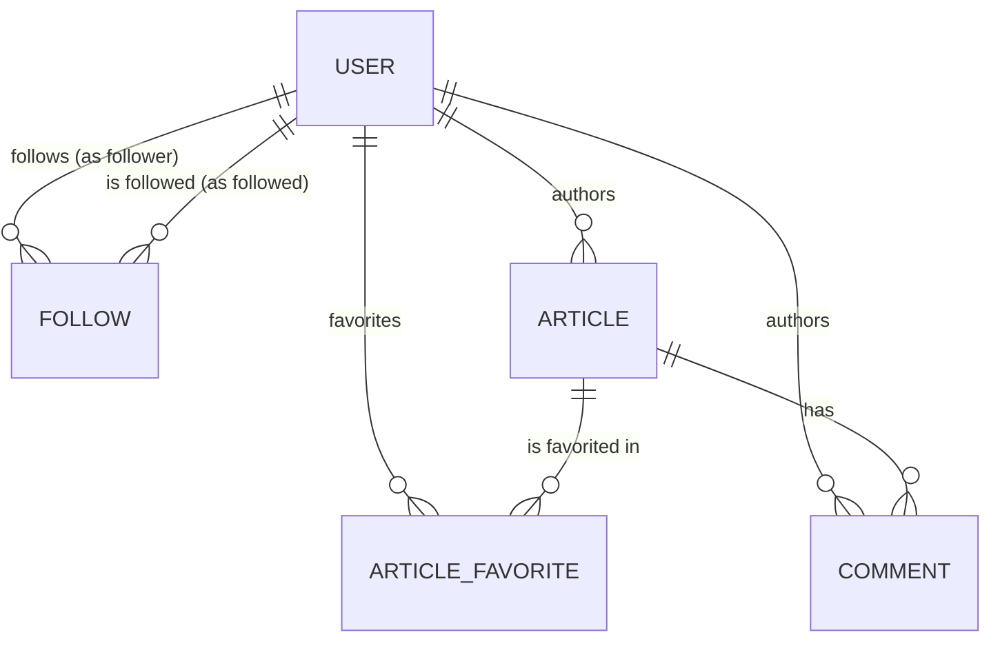

# Architecture: Data Model & Schema

> CNT node — read when: changing the data model, adding entities, modifying schema, or updating the ERD.

## Core Entities

### User (`users`) — ADR-0002, `docs/specs/auth.md`
| Field | Type | Notes |
|---|---|---|
| `id` | uuid (PK) | default `uuid()` |
| `email` | string | **unique** |
| `username` | string | **unique** |
| `bio` | string? | nullable |
| `image` | string? | nullable |
| `passwordHash` | string | Argon2id hash — never the plaintext |
| `createdAt` / `updatedAt` | datetime | managed by Prisma |

### Follow (`follows`) — `docs/specs/profiles.md`
The directed follow edge backing public profiles: `follower` follows `followed`.
| Field | Type | Notes |
|---|---|---|
| `followerId` | uuid (FK → User.id) | on delete cascade |
| `followedId` | uuid (FK → User.id) | on delete cascade; secondary index |
| `createdAt` | datetime | default `now()` |

**Invariants**: composite primary key `(followerId, followedId)` makes a follow
idempotent (at most one edge per pair) and bounds a self-follow to a single
harmless row. Cascade delete keeps the graph consistent when a user is removed.
The viewer-relative `following` flag is *derived* (`isFollowing`), never stored.

### Article (`articles`) — `docs/specs/articles.md`
| Field | Type | Notes |
|---|---|---|
| `id` | uuid (PK) | default `uuid()` |
| `slug` | string | **unique**; derived from the title |
| `title` / `description` / `body` | string | authored content |
| `tagList` | string[] | denormalised onto the row (tag vocabulary is a later concern) |
| `authorId` | uuid (FK → User.id) | on delete cascade; secondary index |
| `createdAt` / `updatedAt` | datetime | managed by Prisma |
| `deletedAt` | datetime? | **soft-delete** marker; secondary index |

**Invariants**: `favoritesCount` is *derived* from the favorites join
(`_count`), never stored. `deletedAt` records a soft delete — per
`docs/operation-classification.md` Tier 3, articles are never hard-deleted, and
every read filters `deletedAt: null` (see `docs/specs/articles.md`).

### ArticleFavorite (`article_favorites`) — `docs/specs/articles.md`
The directed favorite edge: `user` favorited `article`.
| Field | Type | Notes |
|---|---|---|
| `articleId` | uuid (FK → Article.id) | on delete cascade |
| `userId` | uuid (FK → User.id) | on delete cascade; secondary index |
| `createdAt` | datetime | default `now()` |

**Invariants**: composite primary key `(articleId, userId)` makes favoriting
idempotent (at most one edge per pair). Cascade delete keeps the count
consistent when either side is removed.

### Comment (`comments`) — `docs/specs/comments.md`
A comment authored on an article.
| Field | Type | Notes |
|---|---|---|
| `id` | uuid (PK) | default `uuid()` |
| `body` | string | authored content |
| `articleId` | uuid (FK → Article.id) | on delete cascade; secondary index |
| `authorId` | uuid (FK → User.id) | on delete cascade; secondary index |
| `createdAt` / `updatedAt` | datetime | managed by Prisma |
| `deletedAt` | datetime? | **soft-delete** marker; secondary index |

**Invariants**: `deletedAt` records a soft delete — per
`docs/operation-classification.md` Tier 3, comments are never hard-deleted, and
every read filters `deletedAt: null` (see `docs/specs/comments.md`). Both
foreign keys cascade, so a comment cannot outlive its article or author. Listing
is newest-first; the embedded author `following` flag is *derived*, never stored.

## Entity Relationships

## Schema Notes

- ORM: Prisma (`prisma/schema.prisma`), PostgreSQL. Tables are snake-cased via
  `@@map`; relation back-references (`following`, `followers`) are named
  relations so the two FKs into `User` stay unambiguous.
- Migration strategy: `prisma migrate` (reversible up/down); never edit a
  deployed migration. After a schema edit run `prisma generate` so the client
  types track the model.

## DB / State

State lives in PostgreSQL in production. Tests and local dev run against
in-memory fakes (`InMemoryUserRepository`, `InMemoryProfileRepository`) behind
the same repository ports, so no database is required to exercise behaviour.
