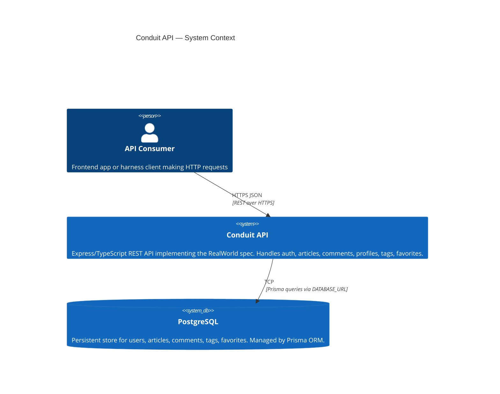
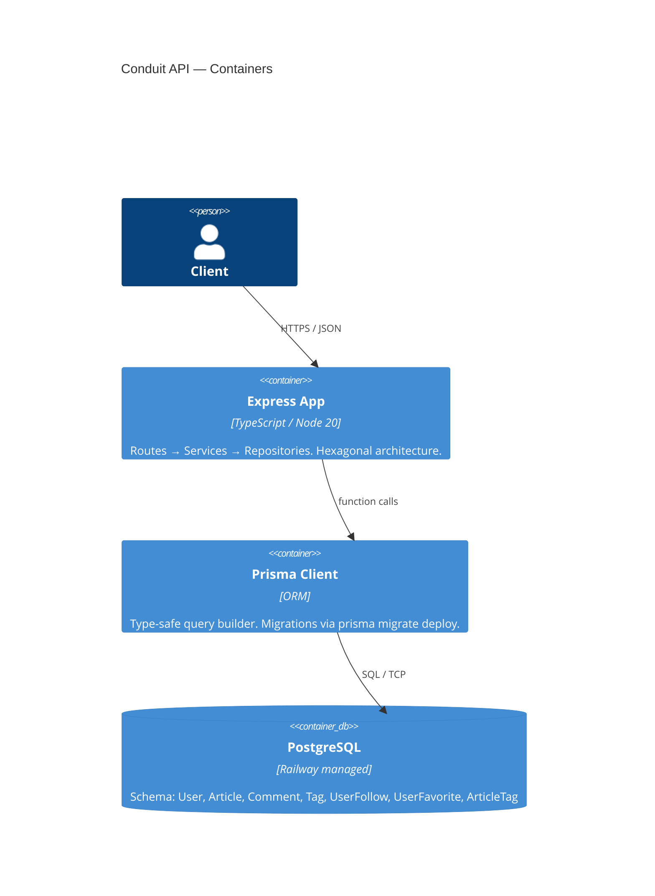

# C4 Context Diagram — Conduit API

## Container View

## Key Boundaries

- **API layer**: Express routes — validation only, delegates to services
- **Service layer**: Business logic — orchestrates repositories, throws domain errors
- **Repository layer**: Prisma adapters — single responsibility per aggregate
- **Domain errors**: `AuthenticationError`, `AuthorizationError`, `NotFoundError`, `ValidationError`, `ConflictError` — each with `toJSON()` per RealWorld spec
